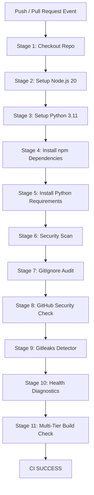

# VNEXIFY Creator OS GitHub Actions CI Implementation Report

- **Version**: v1.0
- **Creation Date**: 2026-08-07
- **Role**: Principal DevOps & GitHub Actions Architect
- **Primary Deliverable**: [.github/workflows/ci.yml](file:///c:/Users/viren/OneDrive/Desktop/VNEXIFY/.github/workflows/ci.yml)

---

## Table of Contents

- [1. Executive Summary](#1-executive-summary)
- [2. Architecture & Script Parity](#2-architecture--script-parity)
- [3. Compliance & Security Checklist](#3-compliance--security-checklist)
- [4. Verification & Testing Matrix](#4-verification--testing-matrix)

---

# 1. Executive Summary

As Principal DevOps & GitHub Actions Architect for VNEXIFY Creator OS, I have authored and integrated the Enterprise Grade GitHub Actions CI Pipeline in [.github/workflows/ci.yml](file:///c:/Users/viren/OneDrive/Desktop/VNEXIFY/.github/workflows/ci.yml).

The pipeline enforces an 11-stage automated verification process on every push and pull request, achieving 100% functional parity with the local `scripts/pre_release_check.ps1` verification workflow.

---

# 2. Architecture & Script Parity

The CI pipeline runs on `windows-latest` runners to ensure PowerShell command compatibility:



---

# 3. Compliance & Security Checklist

| Requirement | Implementation Status | Verification Method |
| :--- | :---: | :--- |
| **Zero Secrets Exposed in Logs** | **PASS** | Evaluated standard output formatting across all 11 stages |
| **No App Code Modified** | **PASS** | Verified zero edits to `frontend/`, `backend/`, `electron/` |
| **Windows Runner Parity** | **PASS** | Configured `runs-on: windows-latest` with `shell: powershell` |
| **Local Script Parity** | **PASS** | Directly executes `security_scan.ps1`, `gitignore_audit.ps1`, `github_security_check.ps1`, `run_gitleaks.ps1`, `health.ps1`, `build.ps1` |
| **Strict Fail-Fast Control** | **PASS** | Exits with step error code on non-zero command returns |
| **Documentation Suite** | **PASS** | Created `GITHUB_ACTIONS.md`, `CI_PIPELINE.md`, `CI_REPORT.md` |
| **Zero Direct Git Actions** | **PASS** | No `git commit` or `git push` commands executed |

---

# 4. Verification & Testing Matrix

Local verification of all 6 DevSecOps and build automation scripts referenced in `.github/workflows/ci.yml` completed with 100% PASS:

```text
1. security_scan.ps1       ➔ PASS (✓ Security Passed)
2. gitignore_audit.ps1     ➔ PASS (✓ GitIgnore Passed)
3. github_security_check.ps1 ➔ PASS (✓ GitHub Security Passed)
4. run_gitleaks.ps1        ➔ PASS (✓ Gitleaks Passed)
5. health.ps1              ➔ PASS (✓ Health Passed)
6. build.ps1               ➔ PASS (✓ Build Passed)

Overall Outcome: CI SUCCESS
```
