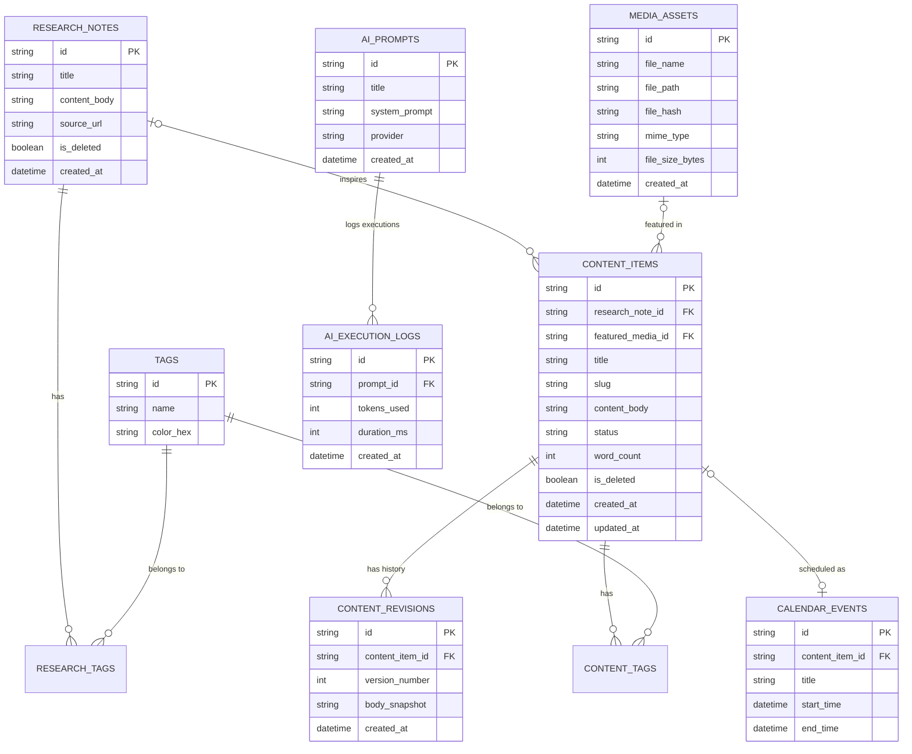

# VNEXIFY Creator OS Database Design Specification

- Version: v0.1
- Creation Date: 2026-08-06
- Status: Draft / Database Architecture Specification
- Author: Senior Database Architect, VNEXIFY Creator OS

---

## Table of Contents

- [1. Database Philosophy](#1-database-philosophy)
- [2. SQLite Strategy](#2-sqlite-strategy)
- [3. Future PostgreSQL Migration Strategy](#3-future-postgresql-migration-strategy)
- [4. Naming Conventions](#4-naming-conventions)
- [5. Primary Keys](#5-primary-keys)
- [6. Foreign Keys \& Constraints](#6-foreign-keys--constraints)
- [7. Indexing Strategy](#7-indexing-strategy)
- [8. Backup Strategy](#8-backup-strategy)
- [9. Migration Strategy](#9-migration-strategy)
- [10. Data Retention Policy](#10-data-retention-policy)
- [11. Security \& Data Protection](#11-security--data-protection)
- [12. Entity Relationships](#12-entity-relationships)
- [13. Entity Relationship Diagram (ERD)](#13-entity-relationship-diagram-erd)
  - [Text / ASCII ERD Format](#text--ascii-erd-format)
  - [Mermaid ERD Format](#mermaid-erd-format)
- [14. Related Documentation Cross-References](#14-related-documentation-cross-references)

---

# 1. Database Philosophy

The database architecture for **VNEXIFY Creator OS** is governed by four core database engineering principles:

1. **Local-First ACID Data Sovereignty**: All user data, content drafts, research notes, and application settings reside locally in a structured database on the client machine. The data layer guarantees full ACID compliance (Atomicity, Consistency, Isolation, Durability) without requiring external cloud database connectivity.
2. **Relational Core with Semi-Structured Flexibility**: High-volume, structural relationships (Content, Media, Tags, Prompts, Schedules) use strict relational schemas, while dynamic metadata, plugin settings, and AI provider configurations utilize semi-structured JSON storage within defined JSON fields.
3. **ORM Abstraction Layer**: All database interactions are mediated through the SQLAlchemy Object-Relational Mapper (ORM) and Pydantic schemas (referencing [TECH_STACK.md](TECH_STACK.md)). Business logic is completely decoupled from database engine specifics.
4. **Forward Compatibility for Enterprise Scaling**: Column types, foreign keys, and migration scripts are architected so that transitioning from local SQLite to enterprise PostgreSQL (for multi-user team synchronization in future versions) requires zero schema structural redesign.

> [!NOTE]
> This document is a **Database Architectural Design Specification**. It defines database concepts, entity models, constraints, and migration strategies. It does NOT contain executable SQL DDL queries or Python table initialization code.

---

# 2. SQLite Strategy

VNEXIFY Creator OS utilizes **SQLite 3** as its primary embedded database engine for local desktop execution (referencing [ARCHITECTURE.md](ARCHITECTURE.md)).

### Storage Location
- **Database File Path**: `backend/db/vnexify.db` (as defined in [FILE_STRUCTURE.md](FILE_STRUCTURE.md)).
- **Environment Isolation**: Separate database files are maintained for development (`vnexify_dev.db`), testing (`vnexify_test.db`), and production (`vnexify.db`).

### Connection Performance Tuning (Pragmas)
To achieve sub-15ms query execution times across concurrent Electron and FastAPI backend processes, every SQLite connection initializes with the following pragma configurations:

- **Write-Ahead Logging (`PRAGMA journal_mode = WAL;`)**: Allows concurrent reads while writes are occurring, eliminating database locking contention between background tasks and the UI.
- **Synchronous Normal (`PRAGMA synchronous = NORMAL;`)**: Provides optimal balance between write throughput performance and ACID power-loss safety when running in WAL mode.
- **Foreign Key Enforcement (`PRAGMA foreign_keys = ON;`)**: Mandatory referential integrity enforcement on all child relationships.
- **Busy Timeout (`PRAGMA busy_timeout = 5000;`)**: Instructs SQLite to wait up to 5,000ms for a write lock to clear before raising a database locked error.
- **RAM Cache Allocation (`PRAGMA cache_size = -64000;`)**: Allocates 64MB of RAM dedicated to query index caching.
- **Incremental Auto-Vacuum (`PRAGMA auto_vacuum = INCREMENTAL;`)**: Enables background page space reclamation without requiring full table locking.

---

# 3. Future PostgreSQL Migration Strategy

While Version 1.0 utilizes embedded SQLite (referencing [PRODUCT_REQUIREMENTS.md](PRODUCT_REQUIREMENTS.md)), future enterprise versions (v2/v3 Team Edition) will support PostgreSQL. The schema is pre-architected to make this transition seamless.

### Data Type Compatibility Mapping

| Schema Logical Type | SQLite Storage Type | PostgreSQL Target Type | Migration Strategy |
| :--- | :--- | :--- | :--- |
| **Primary Key / ID** | `TEXT` | `VARCHAR(36)` / `UUID` | Prefixed ULID/UUID strings (e.g. `cnt_...`) |
| **Short Text** | `TEXT` | `VARCHAR(255)` | Identical string handling |
| **Long Text / Markdown** | `TEXT` | `TEXT` | Unbounded text representation |
| **Numeric Integers** | `INTEGER` | `INTEGER` / `BIGINT` | Standard integer alignment |
| **Boolean Flags** | `INTEGER` (`0` or `1`) | `BOOLEAN` | SQLAlchemy handles boolean mapping |
| **Timestamps** | `TEXT` (ISO 8601 UTC) | `TIMESTAMP WITH TIME ZONE` | Standardized ISO 8601 string parsing |
| **Semi-Structured Data**| `TEXT` (JSON string) | `JSONB` | Native JSONB indexing on PostgreSQL |
| **Binary Assets** | `BLOB` | `BYTEA` | Direct binary compatibility |

---

# 4. Naming Conventions

Strict, uniform naming rules govern all database entities:

- **Table Names**: Lowercase `plural_snake_case` (e.g., `content_items`, `research_notes`, `media_assets`, `ai_prompts`, `system_settings`).
- **Column Names**: Lowercase `singular_snake_case` (e.g., `id`, `title`, `content_type`, `word_count`, `created_at`, `updated_at`).
- **Foreign Key Column Names**: `singular_target_table_name_id` (e.g., `content_item_id`, `media_asset_id`, `user_setting_id`).
- **Junction Table Names**: `table_a_table_b` in alphabetical order (e.g., `content_tags`, `research_tags`).
- **Index Names**: `idx_{table_name}_{column_name(s)}` (e.g., `idx_content_items_status`, `idx_media_assets_file_hash`).
- **Unique Constraint Names**: `uq_{table_name}_{column_name}` (e.g., `uq_content_items_slug`).

---

# 5. Primary Keys

To guarantee global identifier uniqueness across local desktop instances and prepare for future multi-device synchronization without auto-increment collision risks:

* **Format**: Prefixed Universally Unique Lexicographically Sortable Identifiers (ULID) or UUIDv4 strings.
* **Length**: 32-36 characters.
* **Human-Readable Prefixes**:
  - `cnt_` : Content Items (`cnt_01H123456789ABCDEFGHJKMNP`)
  - `rev_` : Content Revisions (`rev_01H123456789ABCDEFGHJKMNP`)
  - `res_` : Research Notes (`res_01H123456789ABCDEFGHJKMNP`)
  - `med_` : Media Assets (`med_01H123456789ABCDEFGHJKMNP`)
  - `tag_` : Tags (`tag_01H123456789ABCDEFGHJKMNP`)
  - `prt_` : AI Prompts (`prt_01H123456789ABCDEFGHJKMNP`)
  - `log_` : AI Execution Logs (`log_01H123456789ABCDEFGHJKMNP`)
  - `cal_` : Calendar Events (`cal_01H123456789ABCDEFGHJKMNP`)
  - `plg_` : Plugins (`plg_01H123456789ABCDEFGHJKMNP`)
  - `sch_` : Scheduled Tasks (`sch_01H123456789ABCDEFGHJKMNP`)

---

# 6. Foreign Keys & Constraints

Referential integrity guarantees that orphaned records cannot exist within the workspace:

### Cascading Delete Rules (`ON DELETE CASCADE`)
Used for tight, owned child entities. If the parent record is deleted, all dependent child entities are automatically deleted:
- Deleting a `content_items` record cascades to delete all associated `content_revisions` and `content_tags` entries.
- Deleting an `ai_prompts` record cascades to delete associated `ai_execution_logs`.

### Nullifying Delete Rules (`ON DELETE SET NULL`)
Used for loose, optional associations. If the referenced entity is removed, the child reference column is set to `NULL` without deleting the child record:
- Deleting a `media_assets` record sets `featured_media_id` in `content_items` to `NULL`.
- Deleting a `research_notes` record sets `parent_research_id` in `content_items` to `NULL`.

---

# 7. Indexing Strategy

Indexes are applied strategically to optimize the API query patterns specified in [API_SPECIFICATION.md](API_SPECIFICATION.md):

1. **Primary & Unique Key Indexes**: Automatically generated for all `PRIMARY KEY` and `UNIQUE` constraints.
2. **Foreign Key Index Rule**: Every foreign key column MUST have an accompanying single-column index to prevent full table scans during `JOIN` operations.
3. **High-Frequency Filter Indexes**:
   - `idx_content_items_status`: Indexes `content_items(status)` for fast filtering by pipeline state (`Draft`, `Scheduled`, `Published`).
   - `idx_content_items_created_at`: Indexes `content_items(created_at)` for reverse-chronological dashboard feeds.
   - `idx_media_assets_mime_type`: Indexes `media_assets(mime_type)` for filtering graphics vs. audio tracks.
4. **Composite Indexes**:
   - `idx_content_status_created`: Composite index on `content_items(status, created_at)` for paginated status queries.
   - `idx_calendar_date_range`: Composite index on `calendar_events(start_time, end_time)` for fast visual range rendering in the Calendar module.
5. **Full-Text Search (FTS5)**: A virtual FTS5 index table (`fts_content_search`) indexes content titles, markdown bodies, research notes, and tags for sub-millisecond keyword search across the entire OS.

---

# 8. Backup Strategy

To ensure zero data loss for local creators:

- **Automated Background Snapshots**: The Python backend uses the SQLite Online Backup API (`sqlite3.connect().backup()`) to create live, non-locking database backups during idle system states.
- **Backup Directory**: Backups are written to `exports/backups/vnexify_backup_YYYYMMDD_HHMMSS.db` (referencing [FILE_STRUCTURE.md](FILE_STRUCTURE.md)).
- **Retention Schedule**: Automated daily backups are retained for 30 days. Point-in-time snapshots are automatically triggered immediately prior to applying database schema migrations.
- **One-Click Restoration**: The Settings module allows users to inspect backup metadata and execute one-click database restorations.

---

# 9. Migration Strategy

Schema versioning is managed using **Alembic** integrated with SQLAlchemy:

- **Migration Folder Location**: `backend/app/db/migrations/`
- **Migration Tracking Table**: Alembic maintains a internal tracking table (`alembic_version`) storing the current schema version hash.
- **Transactional Migrations**: All migration scripts run within explicit database transactions (`BEGIN TRANSACTION ... COMMIT`). If a migration fails mid-execution, changes rollback automatically.
- **Dual Method Rule**: Every migration script MUST supply fully tested `upgrade()` and `downgrade()` methods to allow clean rollback.

---

# 10. Data Retention Policy

- **Soft Delete Pattern**: Core entities (`content_items`, `research_notes`, `media_assets`) implement soft deletion via `is_deleted` (Boolean) and `deleted_at` (Timestamp) columns.
- **Trash Recovery**: Items marked as deleted remain accessible in the "Trash" view for 30 days before permanent purging.
- **Log Auto-Rotation**: Backend system logs in `logs/backend.log` auto-rotate at 50MB with a maximum 5-file historical retention policy (as specified in [SECURITY.md](SECURITY.md)).

---

# 11. Security & Data Protection

- **Local Storage Permissions**: The SQLite database file permissions are restricted (`0600` - read/write owner only) to prevent unauthorized local user account access.
- **Credential Encryption Vault**: Cloud AI API keys (OpenAI, Gemini) and OAuth tokens are **NEVER stored in plaintext** in the database. Credentials are encrypted using AES-256-GCM or stored in the OS native Keychain (via `keyring`) prior to persistence (aligned with [SECURITY.md](SECURITY.md)).
- **SQL Injection Prevention**: 100% of database operations use SQLAlchemy parameterized queries. Raw SQL string concatenation is strictly prohibited (following [CODING_STANDARD.md](CODING_STANDARD.md)).

---

# 12. Entity Relationships

The core database design comprises 10 primary logical entities:

1. `content_items` (Stores core content drafts, articles, scripts, and status lifecycle).
2. `content_revisions` (Historical version snapshots of content items; 1 `content_items` to N `content_revisions`).
3. `research_notes` (Ideation notes, web clips, topic backlogs; 1 `research_notes` to N optional `content_items`).
4. `media_assets` (Indexed local media files in `assets/`; 1 `media_assets` to N optional `content_items`).
5. `tags` (Global taxonomy tags; N `content_items` to M `tags` via `content_tags`; N `research_notes` to M `tags` via `research_tags`).
6. `ai_prompts` (Saved prompt templates and system instructions).
7. `ai_execution_logs` (Audit history of AI generation requests; 1 `ai_prompts` to N `ai_execution_logs`).
8. `calendar_events` (Scheduled publication slots; 1 `calendar_events` to 1 optional `content_items`).
9. `system_settings` (Application configuration key-value settings).
10. `plugins` (Registered plugin states and metadata).

---

# 13. Entity Relationship Diagram (ERD)

### Text / ASCII ERD Format

```text
+-----------------------+           +-----------------------+
|     research_notes    |           |     content_items     |
+-----------------------+           +-----------------------+
| PK  id                |<---(0,N)--| PK  id                |
|     title             |           | FK  research_note_id  |
|     content_body      |           | FK  featured_media_id |----+
|     source_url        |           |     title             |    |
|     is_deleted        |           |     slug              |    |
|     created_at        |           |     content_body      |    |
+-----------------------+           |     status            |    |
           |                        |     word_count        |    |
        (0,N)                       |     is_deleted        |    |
           |                        |     created_at        |    |
           v                        +-----------------------+    |
+-----------------------+            | (1)             | (1)     |
|     research_tags     |            v (N)             v (N)     |
+-----------------------+   +-------------------+  +----------+  |
| PK,FK research_note_id|   | content_revisions |  |content_  |  |
| PK,FK tag_id          |   +-------------------+  |  tags    |  |
+-----------------------+   | PK  id            |  +----------+  |
           |                | FK  content_item_id| | PK,FK cnt|  |
        (N,0)               |     version_num   |  | PK,FK tag|  |
           v                |     body_snapshot |  +----------+  |
+-----------------------+   |     created_at    |       |        |
|         tags          |   +-------------------+     (N,0)      |
+-----------------------+                               v        |
| PK  id                |<------------------------------+        |
|     name              |                                        |
|     color_hex         |           +-----------------------+    |
+-----------------------+           |     media_assets      |    |
                                    +-----------------------+    |
                                    | PK  id                |<---+
                                    |     file_name         |
+-----------------------+           |     file_path         |
|       ai_prompts      |           |     file_hash         |
+-----------------------+           |     mime_type         |
| PK  id                |           |     created_at        |
|     title             |           +-----------------------+
|     system_prompt     |                       ^
|     provider          |                      (1)
+-----------------------+                       |
           |                                   (1)
        (1,N)                       +-----------------------+
           v                        |    calendar_events    |
+-----------------------+           +-----------------------+
|   ai_execution_logs   |           | PK  id                |
+-----------------------+           | FK  content_item_id   |
| PK  id                |           |     title             |
| FK  prompt_id         |           |     start_time        |
|     tokens_used       |           |     end_time          |
|     created_at        |           +-----------------------+
+-----------------------+
```

### Mermaid ERD Format



---

# 14. Related Documentation Cross-References

This Database Design Specification directly aligns with and references the following project documents:

- [PROJECT.md](PROJECT.md) - Project context, baseline scope, and stakeholder goals.
- [PRODUCT_REQUIREMENTS.md](PRODUCT_REQUIREMENTS.md) - Functional module definitions, MVP scope, and 13 core modules.
- [ARCHITECTURE.md](ARCHITECTURE.md) - Backend Python FastAPI architecture and SQLite connection model.
- [TECH_STACK.md](TECH_STACK.md) - Technology specifications for Python, FastAPI, SQLAlchemy, and SQLite.
- [FILE_STRUCTURE.md](FILE_STRUCTURE.md) - Directory specifications for `backend/db/` and `exports/backups/`.
- [CODING_STANDARD.md](CODING_STANDARD.md) - Code quality, database schema naming rules, and ORM guidelines.
- [API_SPECIFICATION.md](API_SPECIFICATION.md) - REST API query patterns, pagination strategies, and error codes.
- [SECURITY.md](SECURITY.md) - Local database security, encryption vault, and log privacy rules.
- [DEVELOPMENT_WORKFLOW.md](DEVELOPMENT_WORKFLOW.md) - Developer database setup and Alembic migration processes.
