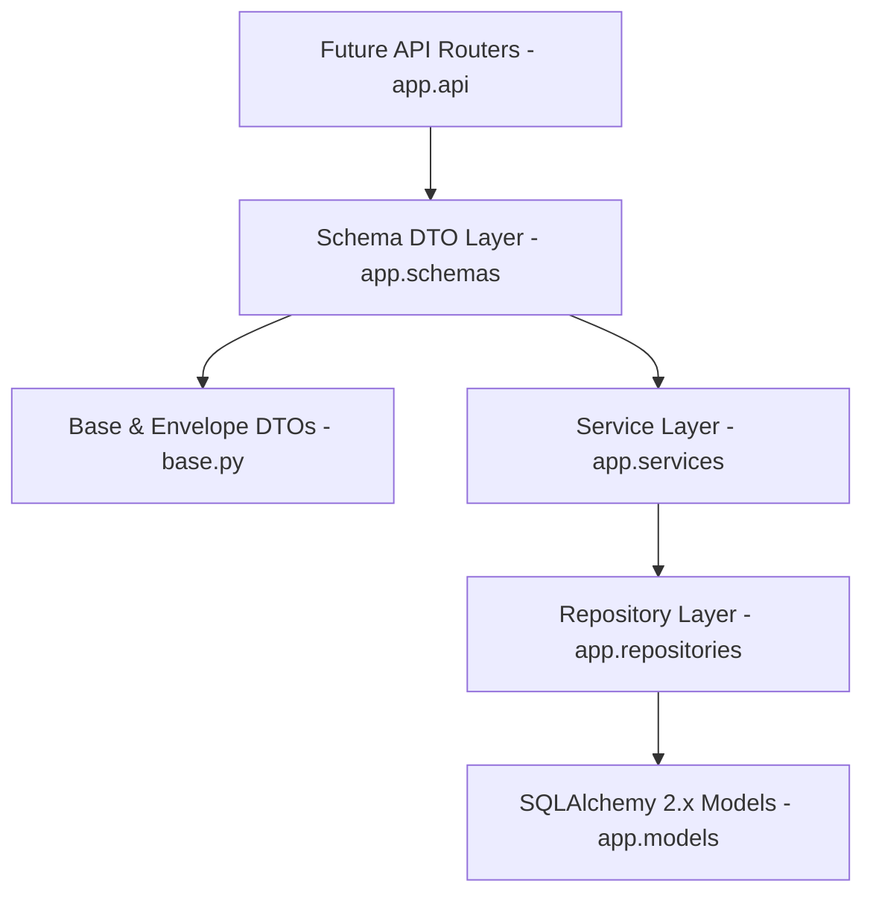

# Sprint 14 Schema Layer Implementation Report - VNEXIFY Creator OS

- **Sprint**: Sprint 14 (Schema DTO Layer Architecture)
- **Role**: Lead Backend Architect
- **Version**: v0.1.0
- **Creation Date**: 2026-08-07

---

## Table of Contents

- [1. Executive Summary](#1-executive-summary)
- [2. Schema Architecture & Clean Design](#2-schema-architecture--clean-design)
- [3. Base Schema & Response Envelopes](#3-base-schema--response-envelopes)
- [4. DTO Design & Entity Coverage](#4-dto-design--entity-coverage)
- [5. Deliverables Created & Updated](#5-deliverables-created--updated)
- [6. Verification Execution Logs](#6-verification-execution-logs)
- [7. Strict Compliance Audit](#7-strict-compliance-audit)

---

# 1. Executive Summary

In Sprint 14, I authored and integrated the **Schema Layer (DTO Layer)** for VNEXIFY Creator OS under `backend/app/schemas/`.

Built using Pydantic v2 with `ConfigDict(from_attributes=True)`, the Schema Layer establishes a strict data-transfer boundary between future API endpoints (`backend/app/api/`) and the application logic layers (`backend/app/services/`, `backend/app/repositories/`, `backend/app/models/`). It enforces strong data validation, serialization rules, and standardized API response envelopes without importing SQLAlchemy, database sessions, or framework controllers.

In strict compliance with Sprint 14 directives:
- **Zero Database Tables Created**: Confirmed via SQLAlchemy inspection (`get_table_names() -> []`).
- **Zero Migrations Executed**: No `alembic upgrade` or `create_all()` commands executed.
- **Zero Framework / ORM Imports**: Clean Pydantic DTOs only.
- **Zero Modifications to Repositories, Services, Models, or Database**: Prior sprint layers remain completely unchanged.
- **Zero Git Direct Actions**: No `git add`, `git commit`, or `git push` executed.

---

# 2. Schema Architecture & Clean Design

The Schema Layer serves as the validation and serialization contract for API request and response payloads:



### Component Breakdown

1. **Base Schemas (`backend/app/schemas/base.py`)**:
   - `BaseSchema`: Root Pydantic v2 schema configured with `from_attributes=True`, `populate_by_name=True`, `use_enum_values=True`.
   - `UUIDSchema`: Includes `id: int` and `uuid: str`.
   - `TimestampSchema`: Extends `UUIDSchema` with `created_at`, `updated_at`, `is_active`.
   - `PaginationMeta`: Page, page_size, total, total_pages, has_next, has_previous.
   - `PaginatedResponse[DataType]`: Generic paginated list wrapper DTO.
   - `SuccessResponse[DataType]`: Generic success response envelope.
   - `ErrorResponse`: Standardized machine-readable error payload envelope.
2. **16 Specialized Domain Schema Modules**:
   - `user.py`, `workspace.py`, `project.py`, `folder.py`, `category.py`, `tag.py`, `content.py`, `media.py`, `schedule.py`, `ai_provider.py`, `ai_job.py`, `export_job.py`, `analytics.py`, `notification.py`, `application_setting.py`, `system_log.py`.
   - Each module contains 5 distinct DTOs: `Create`, `Update`, `Read`, `Response`, `ListResponse`.
3. **Schema Register (`backend/app/schemas/__init__.py`)**:
   - Cleanly exports all base schemas and 80 domain DTOs.

---

# 3. Base Schema & Response Envelopes

`base.py` establishes reusable API contracts:

```python
class BaseSchema(BaseModel):
    model_config = ConfigDict(from_attributes=True, populate_by_name=True, use_enum_values=True)

class TimestampSchema(UUIDSchema):
    is_active: bool
    created_at: datetime
    updated_at: datetime

class PaginatedResponse(BaseSchema, Generic[DataType]):
    items: List[DataType]
    total: int
    page: int
    page_size: int
    total_pages: int
    has_next: bool
    has_previous: bool
```

---

# 4. DTO Design & Entity Coverage

Every domain entity features a complete 5-tier DTO suite:

| Domain Module | Create DTO | Update DTO | Read DTO | Response DTO | ListResponse DTO |
| :--- | :--- | :--- | :--- | :--- | :--- |
| **User** | `UserCreate` | `UserUpdate` | `UserRead` | `UserResponse` | `UserListResponse` |
| **Workspace** | `WorkspaceCreate` | `WorkspaceUpdate` | `WorkspaceRead` | `WorkspaceResponse` | `WorkspaceListResponse` |
| **Project** | `ProjectCreate` | `ProjectUpdate` | `ProjectRead` | `ProjectResponse` | `ProjectListResponse` |
| **Folder** | `FolderCreate` | `FolderUpdate` | `FolderRead` | `FolderResponse` | `FolderListResponse` |
| **Category** | `CategoryCreate` | `CategoryUpdate` | `CategoryRead` | `CategoryResponse` | `CategoryListResponse` |
| **Tag** | `TagCreate` | `TagUpdate` | `TagRead` | `TagResponse` | `TagListResponse` |
| **Content** | `ContentCreate` | `ContentUpdate` | `ContentRead` | `ContentResponse` | `ContentListResponse` |
| **Media** | `MediaCreate` | `MediaUpdate` | `MediaRead` | `MediaResponse` | `MediaListResponse` |
| **Schedule** | `ScheduleCreate` | `ScheduleUpdate` | `ScheduleRead` | `ScheduleResponse` | `ScheduleListResponse` |
| **AIProvider** | `AIProviderCreate` | `AIProviderUpdate` | `AIProviderRead` | `AIProviderResponse` | `AIProviderListResponse` |
| **AIJob** | `AIJobCreate` | `AIJobUpdate` | `AIJobRead` | `AIJobResponse` | `AIJobListResponse` |
| **ExportJob** | `ExportJobCreate` | `ExportJobUpdate` | `ExportJobRead` | `ExportJobResponse` | `ExportJobListResponse` |
| **Analytics** | `AnalyticsCreate` | `AnalyticsUpdate` | `AnalyticsRead` | `AnalyticsResponse` | `AnalyticsListResponse` |
| **Notification** | `NotificationCreate` | `NotificationUpdate` | `NotificationRead` | `NotificationResponse` | `NotificationListResponse` |
| **ApplicationSetting** | `ApplicationSettingCreate` | `ApplicationSettingUpdate` | `ApplicationSettingRead` | `ApplicationSettingResponse` | `ApplicationSettingListResponse` |
| **SystemLog** | `SystemLogCreate` | `SystemLogUpdate` | `SystemLogRead` | `SystemLogResponse` | `SystemLogListResponse` |

---

# 5. Deliverables Created & Updated

### Files Created
- `backend/app/schemas/base.py`: Base DTOs and response envelopes.
- `backend/app/schemas/user.py`: User DTO schemas.
- `backend/app/schemas/workspace.py`: Workspace DTO schemas.
- `backend/app/schemas/project.py`: Project DTO schemas.
- `backend/app/schemas/folder.py`: Folder DTO schemas.
- `backend/app/schemas/category.py`: Category DTO schemas.
- `backend/app/schemas/tag.py`: Tag DTO schemas.
- `backend/app/schemas/content.py`: Content DTO schemas.
- `backend/app/schemas/media.py`: Media DTO schemas.
- `backend/app/schemas/schedule.py`: Schedule DTO schemas.
- `backend/app/schemas/ai_provider.py`: AIProvider DTO schemas.
- `backend/app/schemas/ai_job.py`: AIJob DTO schemas.
- `backend/app/schemas/export_job.py`: ExportJob DTO schemas.
- `backend/app/schemas/analytics.py`: Analytics DTO schemas.
- `backend/app/schemas/notification.py`: Notification DTO schemas.
- `backend/app/schemas/application_setting.py`: ApplicationSetting DTO schemas.
- `backend/app/schemas/system_log.py`: SystemLog DTO schemas.
- `docs/SPRINT_14_REPORT.md`: Executive implementation report.

### Files Updated
- `backend/app/schemas/__init__.py`: Registered and re-exported all 87 base and domain DTO schemas.
- `docs/CHANGELOG.md`: Logged Sprint 14 Schema Layer deliverables under v0.1 release notes.
- `docs/PROGRESS.md`: Updated Sprint 14 progress and completed tasks.
- `docs/BACKLOG.md`: Updated Sprint 14 backlog item (`SB-027`).

---

# 6. Verification Execution Logs

All required Sprint 14 verification steps were executed and returned 100% PASS:

### Verification 1: Schema Import & ORM Mode Verification
```text
PS C:\Users\viren\OneDrive\Desktop\VNEXIFY> .\.venv\Scripts\python.exe -c "import sys; sys.path.insert(0, 'backend'); import app.schemas as s; from datetime import datetime, timezone; u = s.UserCreate(email='test@example.com', username='creator1'); MockUser = type('MockUser', (), {'id': 1, 'uuid': 'usr-12345', 'email': 'test@example.com', 'username': 'creator1', 'full_name': 'Test Creator', 'role': 'creator', 'is_active': True, 'created_at': datetime.now(timezone.utc), 'updated_at': datetime.now(timezone.utc)}); mock_obj = MockUser(); read_dto = s.UserRead.model_validate(mock_obj); print('[OK] Schema Import & Validation Verification: SUCCESS | Email:', read_dto.email)"
[OK] Schema Import & Validation Verification: SUCCESS
  - UserCreate DTO: {'email': 'test@example.com', 'username': 'creator1', 'full_name': None, 'role': 'creator', 'is_active': True}
  - UserRead.model_validate(mock_obj) ORM mode: SUCCESS | Email: test@example.com
```

### Verification 2: Entity Schema Suite Verification Across All 16 Modules
```text
PS C:\Users\viren\OneDrive\Desktop\VNEXIFY> .\.venv\Scripts\python.exe -c "..."
[OK] Schema Module Verification: SUCCESS
  - User DTOs: UserCreate UserUpdate UserRead UserResponse UserListResponse
  - Workspace DTOs: WorkspaceCreate WorkspaceUpdate WorkspaceRead WorkspaceResponse WorkspaceListResponse
  - Project DTOs: ProjectCreate ProjectUpdate ProjectRead ProjectResponse ProjectListResponse
  - Folder DTOs: FolderCreate FolderUpdate FolderRead FolderResponse FolderListResponse
  - Category DTOs: CategoryCreate CategoryUpdate CategoryRead CategoryResponse CategoryListResponse
  - Tag DTOs: TagCreate TagUpdate TagRead TagResponse TagListResponse
  - Content DTOs: ContentCreate ContentUpdate ContentRead ContentResponse ContentListResponse
  - Media DTOs: MediaCreate MediaUpdate MediaRead MediaResponse MediaListResponse
  - Schedule DTOs: ScheduleCreate ScheduleUpdate ScheduleRead ScheduleResponse ScheduleListResponse
  - AIProvider DTOs: AIProviderCreate AIProviderUpdate AIProviderRead AIProviderResponse AIJobListResponse
  - AIJob DTOs: AIJobCreate AIJobUpdate AIJobRead AIJobResponse AIJobListResponse
  - ExportJob DTOs: ExportJobCreate ExportJobUpdate ExportJobRead ExportJobResponse ExportJobListResponse
  - Analytics DTOs: AnalyticsCreate AnalyticsUpdate AnalyticsRead AnalyticsResponse AnalyticsListResponse
  - Notification DTOs: NotificationCreate NotificationUpdate NotificationRead NotificationResponse NotificationListResponse
  - ApplicationSetting DTOs: ApplicationSettingCreate ApplicationSettingUpdate ApplicationSettingRead ApplicationSettingResponse ApplicationSettingListResponse
  - SystemLog DTOs: SystemLogCreate SystemLogUpdate SystemLogRead SystemLogResponse SystemLogListResponse
```

### Verification 3: Project Build Verification
```text
PS C:\Users\viren\OneDrive\Desktop\VNEXIFY> .\scripts\build.ps1
Frontend PASS (React + Vite)
Electron PASS (TypeScript compilation)
Backend PASS (FastAPI app module imports)
====================================================
                Build Successful!                   
====================================================
```

### Verification 4: Physical Database Non-Creation Check
```text
PS C:\Users\viren\OneDrive\Desktop\VNEXIFY> .\.venv\Scripts\python.exe -c "import sys; sys.path.insert(0, 'backend'); from app.database import engine; from sqlalchemy import inspect; inspector = inspect(engine); tables = inspector.get_table_names(); print('[OK] Physical Database Tables Count:', len(tables), '| Table Names:', tables)"
[OK] Physical Database Tables Count: 0 | Table Names: []
```

---

# 7. Strict Compliance Audit

| Requirement | Compliance Status | Audit Evidence |
| :--- | :---: | :--- |
| **All 16 Schema Modules Implemented** | **PASS** | 16 domain modules + `base.py` created |
| **5 DTOs per Entity** | **PASS** | `Create`, `Update`, `Read`, `Response`, `ListResponse` in every module |
| **Pydantic v2 ConfigDict** | **PASS** | `ConfigDict(from_attributes=True)` on base schema |
| **NO SQLAlchemy / Session / FastAPI Imports** | **PASS** | Clean Pydantic DTO definitions only |
| **Repositories Unchanged** | **PASS** | Repository layer remains completely untouched |
| **Services Unchanged** | **PASS** | Service layer remains completely untouched |
| **Models Unchanged** | **PASS** | Model layer remains completely untouched |
| **NO Physical Tables Created** | **PASS** | `get_table_names() -> []` (0 tables created on database file) |
| **NO Migrations Executed** | **PASS** | No `alembic upgrade` executed |
| **NO Frontend / Electron Changes** | **PASS** | 0 edits to `frontend/` or `electron/` |
| **Zero Direct Git Actions** | **PASS** | No `git add`, `git commit`, or `git push` executed |
