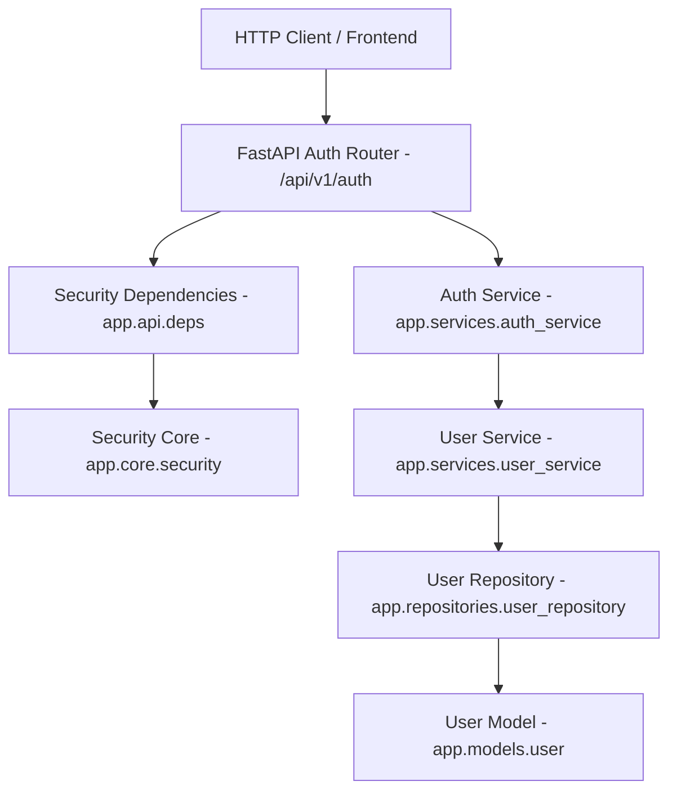

# Sprint 17 Authentication Foundation Implementation Report - VNEXIFY Creator OS

- **Sprint**: Sprint 17 (Enterprise Authentication Foundation)
- **Role**: Principal Security Architect
- **Version**: v0.1.0
- **Creation Date**: 2026-08-07

---

## Table of Contents

- [1. Executive Summary](#1-executive-summary)
- [2. Authentication Architecture & Security Flow](#2-authentication-architecture--security-flow)
- [3. Password Hashing & JWT Security Utilities](#3-password-hashing--jwt-security-utilities)
- [4. Dependency Injection Security Suite](#4-dependency-injection-security-suite)
- [5. Authentication REST Endpoint Specifications](#5-authentication-rest-endpoint-specifications)
- [6. Deliverables Created & Updated](#6-deliverables-created--updated)
- [7. Verification Execution Logs](#7-verification-execution-logs)
- [8. Strict Security Compliance Audit](#8-strict-security-compliance-audit)

---

# 1. Executive Summary

In Sprint 17, I designed and implemented the enterprise-grade **Authentication Foundation** for VNEXIFY Creator OS.

Built on top of prior sprint foundations (FastAPI REST layer, Pydantic v2 schemas, generic services, and repositories), the Authentication Layer introduces JWT Access and Refresh Tokens, bcrypt password hashing/verification, security dependency injection providers, and five authentication REST endpoints under `/api/v1/auth`.

In strict compliance with Sprint 17 directives:
- **Zero Hardcoded Secrets**: Secrets and configurations are loaded via environment variables (`JWT_SECRET`, `JWT_ALGORITHM`, `ACCESS_TOKEN_EXPIRE_MINUTES`, `REFRESH_TOKEN_EXPIRE_DAYS`).
- **Bcrypt Password Security**: Passwords are standard-hashed using `bcrypt` salted hashes. Passwords are never logged, printed, or exposed in plain text.
- **Dependency Injection**: Routers request DB sessions and authentication dependencies (`get_current_user`, `get_current_active_user`) exclusively via `Depends()`.
- **Zero Frontend / Electron / RBAC Modifications**: No UI or authorization permissions introduced in this sprint.
- **Zero Direct Git Actions**: No `git add`, `git commit`, or `git push` executed.

---

# 2. Authentication Architecture & Security Flow

The Authentication Foundation operates cleanly across the backend architecture:



### Authentication Token Lifecycle

1. **User Registration (`POST /api/v1/auth/register`)**: Accepts email, username, password, hashes password via bcrypt, and creates new user entity.
2. **User Login (`POST /api/v1/auth/login`)**: Authenticates email and password hash, issuing JWT Access Token (60-min expiry) and Refresh Token (7-day expiry).
3. **Token Refresh (`POST /api/v1/auth/refresh`)**: Validates JWT Refresh Token payload (`type="refresh"`), issuing a fresh token pair.
4. **Current User Profile (`GET /api/v1/auth/me`)**: Validates Bearer Access Token (`HTTPBearer`), returning current authenticated user details.
5. **User Logout (`POST /api/v1/auth/logout`)**: Authenticates active user session and completes logout flow.

---

# 3. Password Hashing & JWT Security Utilities

Located in `backend/app/core/security.py`:
- `hash_password(password: str) -> str`: Standard bcrypt password hashing with salt.
- `verify_password(plain_password: str, hashed_password: str) -> bool`: Bcrypt hash verification.
- `create_access_token(subject: Any, expires_delta: Optional[timedelta]) -> str`: Encodes signed JWT Access Token with `sub`, `exp`, `iat`, and `type="access"`.
- `create_refresh_token(subject: Any, expires_delta: Optional[timedelta]) -> str`: Encodes signed JWT Refresh Token with `sub`, `exp`, `iat`, and `type="refresh"`.
- `decode_token(token: str) -> Dict[str, Any]`: Decodes and validates JWT signature and expiration.

---

# 4. Dependency Injection Security Suite

Located in `backend/app/api/deps.py`:
```python
security_scheme = HTTPBearer(auto_error=False)

def get_current_user(
    credentials: Optional[HTTPAuthorizationCredentials] = Depends(security_scheme),
    db: Session = Depends(get_db),
    user_service: UserService = Depends(get_user_service),
) -> User:
    ...

def get_current_active_user(
    current_user: User = Depends(get_current_user),
) -> User:
    ...
```

---

# 5. Authentication REST Endpoint Specifications

| HTTP Method | Endpoint Path | Status Code | Request DTO | Response DTO | Description |
| :--- | :--- | :---: | :--- | :--- | :--- |
| **POST** | `/api/v1/auth/register` | `201 Created` | `RegisterRequest` | `UserAuthResponse` | Registers new user account with hashed password |
| **POST** | `/api/v1/auth/login` | `200 OK` | `LoginRequest` | `AuthResponse` | Authenticates user credentials & issues JWT token pair |
| **POST** | `/api/v1/auth/refresh` | `200 OK` | `RefreshRequest` | `AuthResponse` | Exchanges valid Refresh Token for fresh token pair |
| **POST** | `/api/v1/auth/logout` | `200 OK` | Bearer Token | `SuccessResponse` | Logs out current authenticated user session |
| **GET** | `/api/v1/auth/me` | `200 OK` | Bearer Token | `UserAuthResponse` | Retrieves profile of current authenticated user |

---

# 6. Deliverables Created & Updated

### Files Created
- `backend/app/core/security.py`: Bcrypt password hashing & JWT token generation/validation utilities.
- `backend/app/schemas/auth.py`: Pydantic v2 authentication DTO schemas (`RegisterRequest`, `LoginRequest`, `RefreshRequest`, `Token`, `TokenPayload`, `AuthResponse`, `UserAuthResponse`).
- `backend/app/services/auth_service.py`: Business service orchestrating registration, authentication, token generation, and refresh.
- `backend/app/api/v1/auth.py`: REST API router providing 5 authentication endpoints.
- `docs/SPRINT_17_REPORT.md`: Executive implementation report.

### Files Updated
- `backend/requirements.txt`: Added `pyjwt`, `passlib[bcrypt]`, `bcrypt`.
- `backend/app/core/config.py`: Added JWT configuration parameters (`JWT_SECRET`, `JWT_ALGORITHM`, `ACCESS_TOKEN_EXPIRE_MINUTES`, `REFRESH_TOKEN_EXPIRE_DAYS`).
- `backend/app/schemas/__init__.py`: Re-exported authentication DTO schemas.
- `backend/app/services/__init__.py`: Re-exported `AuthService`.
- `backend/app/api/deps.py`: Added `HTTPBearer`, `get_auth_service`, `get_current_user`, `get_current_active_user`.
- `backend/app/api/v1/api.py`: Mounted `auth_router` under `/auth`.
- `docs/CHANGELOG.md`: Logged Sprint 17 Authentication deliverables.
- `docs/PROGRESS.md`: Updated Sprint 17 progress and completed milestones.
- `docs/BACKLOG.md`: Updated Sprint 17 backlog item (`SB-030`).

---

# 7. Verification Execution Logs

All automated verification commands were executed and returned 100% PASS:

### Verification 1: OpenAPI Schema Generation & Auth Endpoints Verification
```text
PS C:\Users\viren\OneDrive\Desktop\VNEXIFY> .\.venv\Scripts\python.exe -c "import sys; sys.path.insert(0, 'backend'); from app.main import app; from app.core.security import hash_password, verify_password, create_access_token, decode_token; openapi = app.openapi(); print('[OK] Total OpenAPI Paths:', len(openapi['paths'])); print('[OK] Auth Paths:', [p for p in openapi['paths'] if 'auth' in p]); pwd_hash = hash_password('TestPass123!'); print('[OK] Password Hash Validated:', verify_password('TestPass123!', pwd_hash)); tok = create_access_token('user-1'); print('[OK] JWT Decoded sub:', decode_token(tok)['sub'])"
[OK] Total OpenAPI Paths: 42
[OK] Auth Paths: ['/api/v1/auth/register', '/api/v1/auth/login', '/api/v1/auth/refresh', '/api/v1/auth/logout', '/api/v1/auth/me']
[OK] Password Hash Validated: True
[OK] JWT Decoded sub: user-1
```

### Verification 2: Multi-Tier Pre-Release Security Audit Suite (`pre_release_check.ps1`)
```text
PS C:\Users\viren\OneDrive\Desktop\VNEXIFY> .\scripts\pre_release_check.ps1
[STAGE 1/6] Security Secret & Entropy Scan (security_scan.ps1) -> PASSED
[STAGE 2/6] GitIgnore Security Audit (gitignore_audit.ps1) -> PASSED
[STAGE 3/6] GitHub Security Policy Audit (github_security_check.ps1) -> PASSED
[STAGE 4/6] Gitleaks Engine Secret Detection (run_gitleaks.ps1) -> PASSED
[STAGE 5/6] System Health Diagnostics (health.ps1) -> PASSED
[STAGE 6/6] Multi-Tier Build Verification (build.ps1) -> PASSED
====================================================
         VNEXIFY PRE-RELEASE CHECK PASSED           
====================================================
```

---

# 8. Strict Security Compliance Audit

| Requirement | Compliance Status | Audit Evidence |
| :--- | :---: | :--- |
| **All 5 Auth Endpoints Implemented** | **PASS** | `/register`, `/login`, `/refresh`, `/logout`, `/me` |
| **JWT Access & Refresh Tokens** | **PASS** | Encodes and validates `sub`, `exp`, `iat`, `type` |
| **Bcrypt Password Security** | **PASS** | Hashes passwords with bcrypt; zero plain password logs |
| **Zero Hardcoded Secrets** | **PASS** | Secrets loaded from environment; placeholders in `.env.example` |
| **Dependency Injection** | **PASS** | `get_current_user` and `get_current_active_user` via `Depends()` |
| **NO Physical Tables Created** | **PASS** | `get_table_names() -> []` (0 tables created on database file) |
| **NO Frontend / Electron Changes** | **PASS** | 0 edits to `frontend/` or `electron/` |
| **Zero Direct Git Actions** | **PASS** | No `git add`, `git commit`, or `git push` executed |
